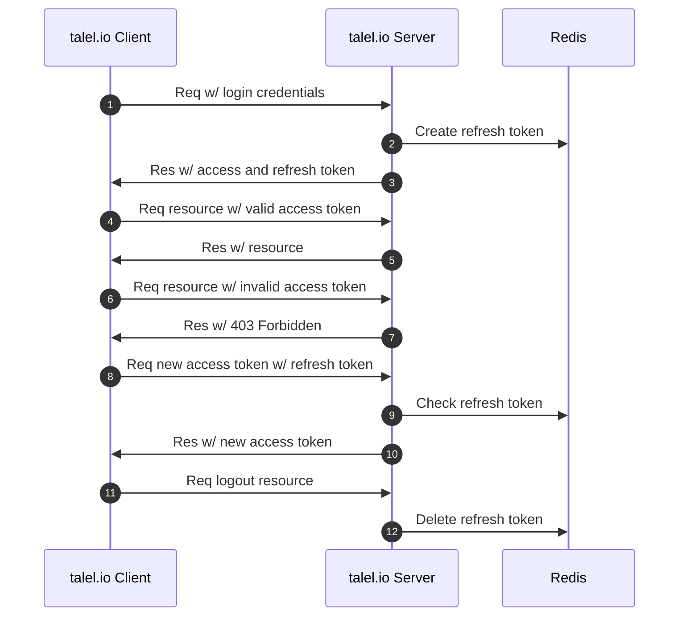
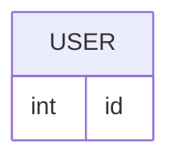

  [](https://codecov.io/gh/taleldayekh/talel.io-backend)

# Table of Contents

- [Development](#development)
  - [Clone Repository](#clone-repository)
  - [Setup Python](#setup-python)
  - [Install Dependencies](#install-dependencies)
  - [Start Development Database](#start-development-database)
  - [Stop Development Database](#stop-development-database)
  - [Serve API](#serve-api)
- [REST API](#rest-api)

# Development

## Clone Repository

```shell
git clone git@github.com:taleldayekh/talel.io-backend.git
```

## Setup Python

### pyenv

[pyenv (Python Version Management)](https://github.com/pyenv/pyenv) can be used for easily managing Python versions globally on the system and locally for a project.

Install pyenv with:

```shell
brew install pyenv
```

Set the project specific Python version defined in the [`Pipfile`](https://github.com/taleldayekh/talel.io-backend/blob/develop/Pipfile) by navigating to the project root and running:

```shell
pyenv local <version>
```

### Pipenv

`talel.io-backend` uses [Pipenv](https://github.com/pypa/pipenv) for managing the projects virtual environment and dependencies.

Install Pipenv with:

```shell
brew install pipenv
```

Activate the virtual environment for `talel.io-backend` by navigating to the project root and running:

```shell
pipenv shell
```

## Install Dependencies

> ⚠️ Dependency installation will fail if PostgreSQL is not installed on the system.

Install PostgreSQL:

```shell
brew install postgresql@14
```

Install dependencies and dev dependencies by navigating to the project root and running:

```shell
pipenv install --dev
```

## Start Development Database

The development database runs in a Docker container and requires [Docker Desktop](https://docs.docker.com/desktop/) installed and running.

Install Docker Desktop:

```shell
brew install --cask docker
```

Start development database container:

```shell
make start-dev-dbs
```

This will start a PostgreSQL database configured for development and run the most recent migrations.

## Stop Development Database

Stop development database container:

```shell
make stop-dev-dbs
```

## Serve API

Before serving the API ensure there is a `.env` present in the project root containing the same values as in [`.env.example`](https://github.com/taleldayekh/talel.io-backend/blob/develop/.env.example).

Serve backend API:

```shell
make serve-api
```

This will run the development server on port `5000`.

# REST API

Full API reference documentation is available on the [Wiki page](https://github.com/taleldayekh/talel.io-backend/wiki/REST-API).


<!-- # Table of Contents
- [Authentication](#authentication)
- [Persistent Storage](#persistent-storage)
  - [PostgreSQL](#postgresql)
    - [Database Schema Migration](#database-schema-migration)
    - [Backup](#backup)
  - [AWS S3 (Simple Storage Service)](#aws-s3-simple-storage-service)
  - [Entity Relationship Diagram](#entity-relationship-diagram)
- [REST API](#rest-api)
  - [Resources](#resources)
    - [Health](#health)
    - [Articles](#articles)


# Authentication



# Persistent Storage

## PostgreSQL

### Database Schema Migration

### Backup

The database backup is done in a cron job on the EC2 instance. It is scheduled to make a database dump nightly to an S3 bucket by executing a [backup script](https://github.com/taleldayekh/talel.io-backend/blob/main/scripts/backup_postgres_db.sh).

The backup script is automatically [passed to a Docker volume](https://github.com/taleldayekh/talel.io-backend/blob/f8ef78b0fe7a08c7aa7544ee660427a57d36b422/talelio_backend/entrypoint.sh#L9) after building the backend API container and is available on the host once the [talel.io Backend API Task Definition](https://github.com/taleldayekh/talel.io-backend/blob/main/.aws/talelio-backend-api-task-definition.json) has completed.

The following environment variables are expected in `~/.bash_profile` on the EC2 instance:

- `POSTGRES_USER`
- `POSTGRES_DB`
- `S3_URI`
- `S3_BUCKET`
- `S3_BUCKET_BACKUP_DIR`

#### Configuring the EC2 Cron Job

1. Enter the crontab system with `crontab -e`.

2. Specify cron job to run backup script nightly at 5 AM (3 AM Berlin time):  

   ```shell
   0 5 * * * sudo su <user> -l /var/lib/talelio-scripts/backup_postgres_db.sh
   ```

#### Restore Data from Database Backup

The data can be restored in a dockerized PostgreSQL database by issuing:

```shell
docker exec -i <container id> psql -U <database user> -d <database name> < /path/to/postgres_db_backup.sql
```

## AWS S3 (Simple Storage Service)

The talel.io backend uses S3[^1] buckets for storing user content, test content and database backups.

#### Publicly Accessible Buckets

Both the bucket for user content and test content have their policy permissions set to `AllowPublicRead` which grants outside access to any content in those buckets. The `IAM` user holding the `Access key ID` associated with the talel.io backend have additional permissions for making API calls to perform CRUD operations on bucket objects.

#### Private Buckets

The bucket for database backups have all public access blocked and only the EC2 instance is allowed full access via the `IAM Role` attached to the instance.

## Entity Relationship Diagram



# REST API

### Articles

| HTTP Method | Description                                                 | Resource                                          | Success Code | Failure Code |
|-------------|-------------------------------------------------------------|---------------------------------------------------|--------------|--------------|
| GET         | [List articles for a user](#get---list-articles-for-a-user) | /\<version\>/users/\<username\>/articles          | 200          | 400          |
| GET         | [Article](#get---article)                                   | /\<version\>/articles/\<slug/>                    |              |              |

<details>

<summary>GET - List articles for a user</summary>
<br/>

Pagination is achieved with the `?page=<number>&limit=<number>` query parameters.

#### Request

```shell
curl -X GET \
https://api.talel.io/v1/users/<username>/articles
```

#### Success Response

_*Link Header*_

URLs for the next and previous pagination values.

```shell
Link: </users/<username>/articles?page=3&limit=10>; rel="next",
</users/<username>/articles?page=1&limit=10>; rel="prev"
```

_*X-Total-Count Header*_

Total number of articles for the queried user.

```shell
X-Total-Count: 100
```

_*Response Body*_

```shell
200: OK

{
   "user": {
      "username": "talel",
      "location": "Berlin",
      "avatar_url": "/url/to/avatar.jpg"
   },
   "articles": [
      {
         "id": 1,
         "created_at": "1986-06-05T00:00:00.000000",
         "updated_at": null,
         "title": "Hello World Article",
         "slug": "hello-world-article",
         "body": "# Hello World",
         "meta_description": "An article published on talel.io",
         "html": "<h1>Hello World</h1>",
         "featured_image": "/url/to/featured_image.jpg",
         "url": "https://www.talel.io/articles/hello-world-article"
      }
   ]
}
```

#### Error Response

```shell
400: BAD REQUEST

{
   "error": {
      "message": "Expected numeric query parameters",
      "status": 400,
      "type": "Bad Request"
   }
}
```

</details>

<details>

<summary>GET - Article</summary>

#### Request

```shell
curl -X GET \
https://api.talel.io/v1/articles/<slug>
```

#### Success Response

_*Response Body*_

```shell
200: OK

{
  "meta": {
    "adjacent_articles": {
      "next": {
        "title": "Next Article",
        "slug": "next-article"
      },
      "prev": {
        "title": "Previous Article",
        "slug": "previous-article"
      }
    }
  },
  "article": {
    "id": 2,
    "created_at": "1986-06-05T00:00:00.000000",
    "updated_at": null,
    "title": "Hello World Article",
    "slug": "hello-world-article",
    "body": "# Hello World",
    "meta_description": "An article published on talel.io",
    "html": "<h1>Hello World</h1>",
    "featured_image": "/url/to/featured_image.jpg",
    "url": "https://www.talel.io/articles/hello-world-article"
  }
}
```

#### Error Response

```shell
404: NOT FOUND

{
  "error": {
    "message": "Article not found",
    "status": 404,
    "type": "Not Found"
  }
}
```

</details>

[^1]: [S3 pricing.](https://aws.amazon.com/s3/pricing/?nc=sn&loc=4) -->
