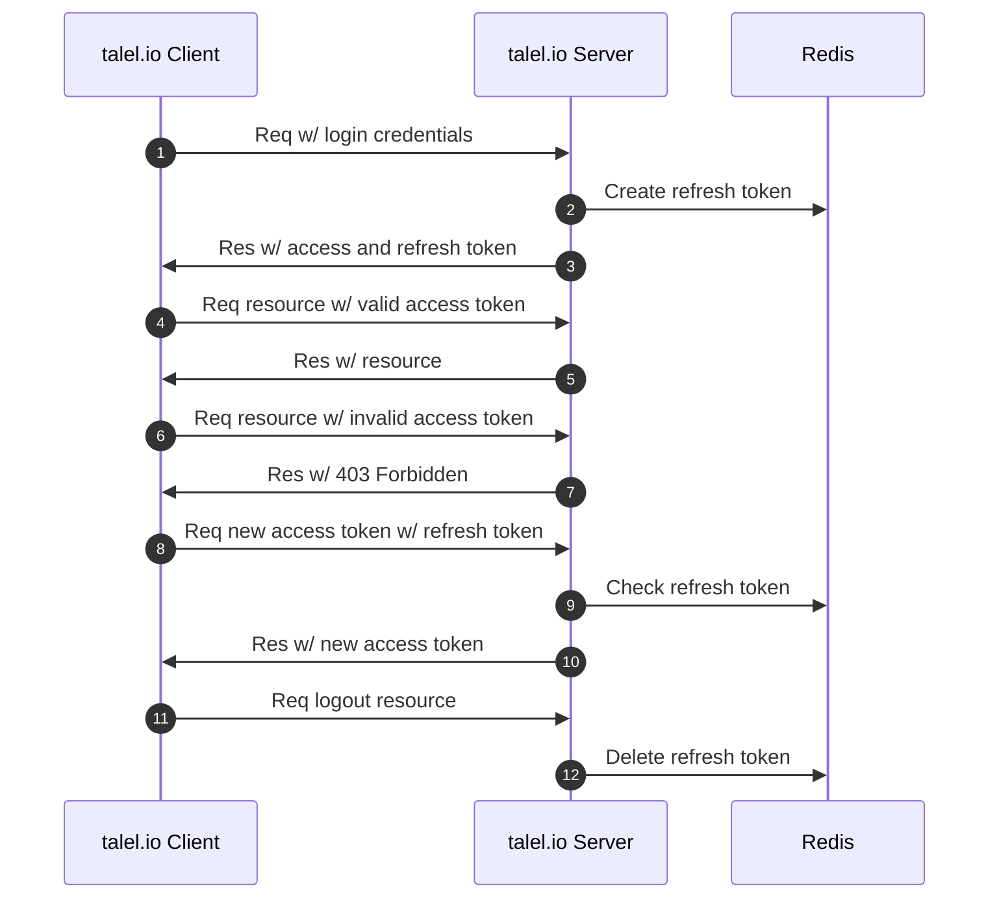

  [](https://codecov.io/gh/taleldayekh/talel.io-backend)

# Table of Contents

- [Authentication](#authentication)
- [Persistent Storage](#persistent-storage)
  - [PostgreSQL](#postgresql)
    - [Database Schema Migration](#database-schema-migration)
    - [Backup](#backup)
  - [AWS S3 (Simple Storage Service)](#aws-s3-simple-storage-service)

# Authentication



# Persistent Storage

## PostgreSQL

### Database Schema Migration

### Backup

The database backup is done in a cron job on the EC2 instance. It is scheduled to make a database dump nightly to an S3 bucket by executing a [backup script](https://github.com/taleldayekh/talel.io-backend/blob/main/scripts/backup_postgres_db.sh).

The backup script is automatically [passed to a Docker volume](https://github.com/taleldayekh/talel.io-backend/blob/f8ef78b0fe7a08c7aa7544ee660427a57d36b422/talelio_backend/entrypoint.sh#L9) after building the backend API container and is available on the host once the [talel.io Backend API Task Definition](https://github.com/taleldayekh/talel.io-backend/blob/main/.aws/talelio-backend-api-task-definition.json) has completed.

The following environment variables are expected in `~/.bash_profile` on the EC2 instance:

- `POSTGRES_USER`
- `POSTGRES_DB`
- `S3_URI`
- `S3_BUCKET`
- `S3_BUCKET_BACKUP_DIR`

#### Configuring the EC2 Cron Job

1. Enter the crontab system with `crontab -e`.

2. Specify cron job to run backup script nightly at 5 AM (3 AM Berlin time):  

   ```shell
   0 5 * * * sudo su <user> -l /var/lib/talelio-scripts/backup_postgres_db.sh
   ```

#### Restore Data from Database Backup

The data can be restored in a dockerized PostgreSQL database by issuing:

```shell
docker exec -i <container id> psql -U <database user> -d <database name> < /path/to/postgres_db_backup.sql
```

## AWS S3 (Simple Storage Service)

The talel.io backend uses S3[^1] buckets for storing user content, test content and database backups.

#### Publicly Accessible Buckets

Both the bucket for user content and test content have their policy permissions set to `AllowPublicRead` which grants outside access to any content in those buckets. The `IAM` user holding the `Access key ID` associated with the talel.io backend have additional permissions for making API calls to perform CRUD operations on bucket objects.

#### Private Buckets

The bucket for database backups have all public access blocked and only the EC2 instance is allowed full access via the `IAM Role` attached to the instance.


[^1]: [S3 pricing.](https://aws.amazon.com/s3/pricing/?nc=sn&loc=4)
---

1. User sends a login request with their credentials
2. The server creates a refresh token and stores it in Redis
3. The server sends a access token together with the refresh token in a response to the user. The access token is sent in the json response while the refresh token gets stored in a cookie.
4. When the user makes a request to a protected resource the access token is sent in the request header 
5. and if it is valid the server will respond with returning the requested resource.
6. When the user makes a request with a expired access token (rename in mermaid to expired instead of invalid)
7. The server cannot validate the user and therefore denies access to the requested resource by returning a 403 Forbidden
8. The client gets the 403 and uses this 403 response to the server with the refresh token that is used to get a new access token
9. The server checks the validity of the refresh token in Redis
10. If the refresh token is valid the server issues a new access token and to the user that the user can use to retrieve their resource
11. A user can other than wait for the longer refresh token to expire also logout which will expire the refresh token
12. When a user logsout the refresh token is completely deleted from Redis.

# Table of Contents

- [Architecture](#architecture)
  - [Presentation Layer](#presentation-layer)
  - [Business Logic Layer](#business-logic-layer)
  - [Data Layer](#data-layer)
- [Database Schema Migration](#database-schema-migration)
- [Development](#development)
  - [Setup](#setup)
  - [Code Style](#code-style)
  - [Testing](#testing)
  - [CI/CD](#cicd)
- [Deployment](#deployment)
  - [Deployment Stack](#deployment-stack)
    - [GitHub](#github)
    - [AWS ECR](#aws-ecr-elastic-container-registry)
    - [AWS ECS](#aws-ecs-elastic-container-service)
    - [AWS EC2](#aws-ec2-elastic-computing)
      - [AWS Elastic IP and Namecheap DNS](#aws-elastic-ip-and-namecheap-dns)
      - [Traefik Reverse Proxy](#traefik-reverse-proxy)
      - [Gunicorn](#gunicorn)
      - [Flask](#flask)
      - [PostgreSQL DB](postgresql-db)

# Architecture

The project structure is organized to follow a three tier layered architecture that modularize the interface, business logic and data access and where each layer depend only on the layer below.

One core concept is to keep the domain model which is part of the _*business logic layer*_ free from depending on any of the other layers and rather make dependencies flow inwards and to the domain model.

```
╭── Presentation Layer ──╮
│ ╭────────────────────╮ │
│ │      REST API      │ │
│ ╰────────────────────╯ │
╰────────────────────────╯
            ↓
╭─ Business Logic Layer ─╮         ╭──────────────────────╮
│ ╭────────────────────╮ │         │  Presentation Layer  │
│ │      Services      │ │         ╰──────────────────────╯
│ ╰────────────────────╯ │                    ↓
│ ╭────────────────────╮ │         ╭──────────────────────╮
│ │    Domain Model    │ │ ─ ─ ─ ─ │     Domain Model     │
│ ╰────────────────────╯ │         ╰──────────────────────╯
╰────────────────────────╯                    ↑
            ↓                      ╭──────────────────────╮
╭────── Data Layer ──────╮         │      Data Layer      │
│ ╭────────────────────╮ │         ╰──────────────────────╯
│ │    Repositories    │ │
│ ╰────────────────────╯ │
│ ╭────────────────────╮ │
│ │        ORMs        │ │
│ ╰────────────────────╯ │
│ ╭────────────────────╮ │
│ │      Database      │ │
│ ╰────────────────────╯ │
╰────────────────────────╯
```

## Presentation Layer

## Business Logic Layer

## Data Layer

The data layer handles any **infrastructural concerns**. In this layer the storage logic is managed by using the **repository pattern** for accessing a PostgreSQL database and SQL queries are generated using an **ORM**.

### Folder Structure

The data layer is organized in a `data` directory for the separate app packages and in a shared `data` directory.

```
└── talelio_backend/
    └── app_<package_name>/
    ╵   └── data/
    ╵   ╵   └── <package_name>_repository.py
```

```
└── talelio_backend/
    └── shared/
    ╵   └── data/
    ╵   ╵   └── orm.py
    ╵   ╵   └── repository.py
```

### Repositories

The repositories provides an abstraction over the data storage and decouples the business logic layer from the database. They allow for retrieving and storing domain model data while hiding database access details.

The repositories collaborate with a **Unit of Work (uow)** in the services of the business logic layer which groups database transactions and executes them as an _*atomic*_ unit.

### ORMs

[SQLAlchemy](https://github.com/sqlalchemy/sqlalchemy) is used as **ORM (object-relational mapper)** which keeps the domain models database agnostic and allows to easy switch the persistence storage at any point in time.

SQLAlchemy helps define schemas, map them to the domain models and generate SQL based on the model objects.

To prevent the domain models from depending on the infrastructure the ORM is implemented using the **dependency inversion principle (DIP)** with which the ORM depends on the model and not the other way around.

### Database

# Authentication

## Authorization Flow

```
╭─────────────────╮                              ╭─────────────────╮                ╭───────╮
│ talel.io Client │                              │ talel.io Server │                │ Redis │
╰─────────────────╯                              ╰─────────────────╯                ╰───────╯
         |                                                |                             |
	 | ---------- Req w/ login credentials ---------> | -- Create refresh token --> |
	 |                                                |                             |
	 | <------ Res w/ access & refresh token -------- |                             |
	 |                                                |                             |
	 | ----- Req resource w/ valid access token ----> |                             |
	 |                                                |                             |
	 | <------------- Res w/ resource --------------- |                             |
	 |                                                |                             |
	 | ---- Req resource w/ invalid access token ---> |                             |
	 |                                                |                             |
	 | <----------- Res w/ 403 Forbidden ------------ |                             |
	 |                                                |                             |
	 | -- Req new access token with refresh token --> | --- Check refresh token --> |
	 |                                                |                             |
	 | <--------- Res w/ new access token ----------- |                             |
	 |                                                |                             |
	 | ------------ Req logout resource ------------> | -- Delete refresh token --> |
```

# File Storage

# Database Schema Migration

Database migrations is handled with [Alembic](https://github.com/sqlalchemy/alembic).

Run Alembic in the command line whenever a model has been created or modified. This will generate a Python migration script which can be invoked to upgrade the database schema.

1. **Auto-generate migration script**

   ```bash
   alembic revision --autogenerate -m "<message>"
   ```

2. **Perform migration**  

   ```bash
   alembic upgrade head
   ```

Above steps will auto-generate necessary SQL for transforming the database into the new version.

# Development

## Setup

### Clone Repository

```shell
git clone git@github.com:taleldayekh/talel.io-backend.git
```

### Set Git Hooks Path

The Git Hooks path is added locally in the `.git/config` of this repository. Adding this path is necessary for using the hooks located in the `.githooks` directory.

```shell
make set-githooks
```

### Install Dependencies

```shell
pipenv install --dev
```

### Start Development Database

To start the development database make sure Docker is installed and run:

```shell
make start-dev-dbs
```

This will start a Docker container with a PostgreSQL database configured for development and run the most recent migrations.

When running the e2e tests all database tables are dropped after the tests completes. This means that no database queries will be possible if the talel.io backend is served after running the e2e tests.

To continue developing with the test database the container needs to be stopped and restarted. To stop the container run:

```shell
make stop-dev-dbs
```

### Serve API

```shell
make serve-api
```

## Code Style

To maintain consistency across the codebase, coding standards that conforms to the _*PEP 8*_ style guide are enforced with the help of:

- [YAPF](https://github.com/google/yapf) for reformatting the code.

- [isort](https://github.com/PyCQA/isort) for sorting and separating imports.

The formatters are run with:

```shell
make fix
```

To help detect errors and reduce bugs the following static code analysis tools are used:

- [mypy](https://github.com/python/mypy) for checking type errors.

```shell
make type-check
```

- [Pylint](https://github.com/PyCQA/pylint) for checking programming errors.

```shell
make lint
```

## Testing

Tests are written with the help of [pytest](https://github.com/pytest-dev/pytest) and test coverage is generated and reported using [pytest-cov](https://github.com/pytest-dev/pytest-cov) and uploaded to [codecov.io](https://codecov.io).

The codebase is covered with a set of unit, integration and e2e tests.

### Unit Tests

```shell
make test-unit
```

### Integration Tests

```shell
make test-integration
```

### E2E Tests

```shell
make test-e2e
```

The e2e tests needs a running [development database](#start-development-database).

## CI/CD

[GitHub Actions](https://docs.github.com/en/free-pro-team@latest/actions) is used for _*Continuous Integration*_ and _*Continuous Deployment*_.

The CI pipeline runs whenever a pull request is created to the `develop` branch and the CD pipeline runs when code is merged to the `main` branch.

### CI

CI runs all test suites and the static code analysis and uploads the test coverage reports to [codecov.io](https://codecov.io).

### CD

CD runs all test suites and the static code analysis before building a Docker image of the talel.io backend which then gets pushed to and deployed on AWS.

# Deployment

The deployment stack consists of the **talelio backend application**, **Traefik as a reverse proxy** and a **PostgreSQL database**, all running as containerized services on one **AWS EC2 instance** which is provisioned on a **AWS ECS cluster**.

```
                                                ╭ ─ ─ ─ ─ ─ ECS ─ ─ ─ ─ ─ ╮
╭── GitHub Action ──╮   ╭─────── ECR ───────╮     ╭──────── EC2 ────────╮
│╭─────────────────╮│   │╭─────────────────╮│   │ │╭───────────────────╮│ │
││  Backend Image  ││   ││  Backend Image  ││     ││ Backend Container ││
│╰─────────────────╯│   │╰─────────────────╯│   │ │╰───────────────────╯│ │
╰───────────────────╯   │                   │     │                     │
╭────── Local ──────╮   │╭─────────────────╮│   │ │╭───────────────────╮│ │           ╭────────────────╮
│╭─────────────────╮│   ││ Traefik Reverse ││     ││  Traefik Reverse  ││   ← API Req │                │
││ Traefik Reverse ││ → ││   Proxy Image   ││ → │ ││  Proxy Container  ││ │           │  www.talel.io  │
││   Proxy Image   ││   │╰─────────────────╯│     │╰───────────────────╯│   API Res → │                │
│╰─────────────────╯│   │                   │   │ │                     │ │           ╰────────────────╯
│╭─────────────────╮│   │╭─────────────────╮│     │╭───────────────────╮│
││  PostgreSQL DB  ││   ││  PostgreSQL DB  ││   │ ││   PostgreSQL DB   ││ │
││      Image      ││   ││      Image      ││     ││     Container     ││
│╰─────────────────╯│   │╰─────────────────╯│   │ │╰───────────────────╯│ │
╰───────────────────╯   ╰───────────────────╯     ╰─────────────────────╯
                                                ╰ ─ ─ ─ ─ ─ ─ ─ ─ ─ ─ ─ ─ ╯
```

Deployment of the talelio backend image is done automatically in a GitHub Action as part of the continuous deployment while the images for the Traefik reverse proxy and PostgreSQL database needs to be deployed manually.

## Deployment Stack

### GitHub

TXT

### AWS ECR (Elastic Container Registry)

[ECR](https://aws.amazon.com/ecr/) is the Docker image repository on AWS. Each image has a separate repository with different versions of the given image.

The repositories for the **talel.io backend** are:

- **talel.io-backend**
- **nginx**

**Push local Docker image to ECR**

Select a repository and click **View push commands**. This will bring up all necessary steps and commands for authenticating, tagging and pushing a local Docker image.

> The **talel.io-backend** and **nginx** images are automatically pushed to ECR in the CD pipeline.

**Configurations**

The **Lifecycle Policy** for each repository is set to keep only the latest version of an image.

### AWS ECS (Elastic Container Service)

[ECS](https://aws.amazon.com/ecs/) is the orchestration platform on AWS which manages and deploys Docker containers based on the images from ECR.

ECS is configured with the three main components: _*cluster*_, _*task definition*_ and _*service*_.

1. **Cluster (grouping of hardware resources)**  

   The entire backend lies on the **talelio** ECS cluster which currently consists of one provisioned [t2.micro EC2](https://aws.amazon.com/ec2/instance-type/t2/) instance. Both the **talel.io-backend** and **nginx** container runs on this EC2 instance.

   **Configurations**

   The **talelio** cluster has been setup with the following configurations:

   TXT

2. **Task definition**  

   The task definition is a template for how a Docker container gets deployed to the EC2 instance. The **talelio** cluster have two task definitions, a [talelio-backend-task](.aws/talelio-backend-task-definition.json) and a [nginx-task](.aws/nginx-task-definition.json).

3. **Service**  

   TXT

## AWS EC2 (Elastic Computing)

```
   ╭─────────────────╮
   │                 │
   │ talel.io client │
   │                 │
   ╰─────────────────╯
       Req ↓ ↑ Res
╭───────────────────── EC2 ─────────────────────╮
│ ╭──── Container ────╮                         │
│ │╭─────────────────╮│                         │
│ ││ Traefik Reverse ││                         │
│ ││      Proxy      ││                         │
│ │╰─────────────────╯│                         │
│ ╰───────────────────╯                         │
│          ↓ ↑                                  │
│ ╭──── Container ────╮                         │
│ │╭─────────────────╮│                         │
│ ││  Gunicorn WSGI  ││                         │
│ ││   HTTP Server   ││   ╭──── Container ────╮ │
│ │╰─────────────────╯│   │╭─────────────────╮│ │
│ │        ↓ ↑        │ ← ││  PostgreSQL DB  ││ │
│ │╭─────────────────╮│ → ││                 ││ │
│ ││  Flask RESTful  ││   │╰─────────────────╯│ │
│ ││       API       ││   ╰───────────────────╯ │
│ │╰─────────────────╯│                         │
│ ╰───────────────────╯                         │
╰───────────────────────────────────────────────╯
```

The following configurations needs to be considered for a working deployment setup on the EC2 instance.

### AWS Elastic IP and Namecheap DNS

The DNS connects the various `www.talel.io` / `talel.io` domain and subdomains with IP addresses.

The **talel.io API** can be accessed via the subdomain `api.talel.io` which is connected to the EC2 instance with a static IP provided by **AWS Elastic IP**.

**Configurations**

1. **AWS Elastic IP**  

   - Navigate to **EC2** -> **Network & Security** -> **Elastic IPs**.

   - Click to **Allocate Elastic IP address**.

   - Make sure **Amazon's pool of IPv4 addresses** is selected and click **Allocate**.

   - Click on **Associate this Elastic IP address** to bind the Elastic IP address with an EC2 instance.

   - Select the relevant EC2 instance and click **Associate**.

   > An Elastic IP address is free of charge as long as **only that address** is associated with one running EC2 instance.

2. **Namecheap DNS**  

   The **talel.io** domain is registered on [Namecheap](https://www.namecheap.com) and the DNS settings on Namecheap needs to be adjusted to point to the EC2 instance.

   - From **Domain List** click to manage the domain and select **Advanced DNS**.

   - Under **HOST RECORDS** click to **ADD NEW RECORD**.

   - Create a new **A Record** for the various hosts, i.e. `www` for `www.talel.io` and `api` for `api.talel.io`.

   - Add the Elastic IP for the EC2 instance as **Value** for all relevant records.

   > An A Record (Address Record) directs the domain to a server through its IPv4 address and controls what a domain name does when visited.

### PostgreSQL DB

The PostgreSQL container runs as an ECS Service with a mounted volume for persisting the db on the EC2 host.

**Configurations**

The directory in the container where PostgreSQL stores its data needs to be bind mounted in the ECS Task Definition.

- In the `postgresql-task` Task Definition, scroll down to **Volumes** and click on **Add volume**.

- Enter **talelio-postgresql** as **Name**.

- Enter `/var/lib/talelio-postgresql` as **Source path**, this will be the location of the db on the EC2 host.

- Under **Container Definitions** click on the **postgresql-container** and scroll down to **STORAGE AND LOGGING**.

- Select **talelio-postgresql** as **Source volume**.

- Enter `/var/lib/postgresql/data` as **Container path**, this is the path in the container where PostgreSQL creates the db.

### Traefik Reverse Proxy


When a request is made to `api.talel.io` [Traefik](https://github.com/traefik/traefik) acts as a reverse proxy and redirects that request to the Flask REST API service served by Gunicorn.

Traefik forwards everything over `HTTPS` and only exposes ports `80` and `443` for `HTTP` and `HTTPS` respectively as well as port `8080` for the built in [dashboard](https://doc.traefik.io/traefik/operations/dashboard/).

**Configurations**

The Traefik dockerized task runs as a service on the **talelio cluster**. It is not included in the CD pipeline as it is not expected to be redeployed frequently.

Any service that is deployed on ECS and configured with the correct Docker labels will automatically get picked up by Traefik.

> The Traefik [static](/traefik/traefik.toml) and [dynamic](/traefik/traefik_dynamic.toml) configuration files are well-commented.

1. **Traefik Static Configurations**  

   These configurations are set once when the container is launched and in addition to specifying ports and HTTPS forwarding this is also where the ECS provider and TLS certificate generation is defined.

   - **ECS Provider**  

     Enables the use of Traefik in a ECS cluster.

   - **TLS with Let's Encrypt**  

     In the configurations a **Certificate Resolver** is defined which retrives a certificate and enables TLS for a domain. This happens when a **router** in the dynamic configurations requests a certificate for a domain.

     Certificates are automatically renewed.

     > ⚠️ If the `caServer` staging server was used for generating test certificates, generating production certificates might fail unless the files created during testing are manually deleted from the host.

2. **Traefik Dynamic Configurations**  

   TXT

### Gunicorn

The Flask built in web server is meant for development only and is not suitable for handling concurrent requests in production. For production, a [Gunicorn WSGI application server](https://github.com/benoitc/gunicorn) is used to serve the Flask REST API service Python code.

Gunicorn runs behind NGINX.

### Flask

TXT


<!-- ```

## AWS ECR (Elastic Container Registry)

The Docker image artifacts which represents the application backend and frontend are hosted with [Amazon Elastic Container Registry](https://aws.amazon.com/ecr/).

### Configurations -->
